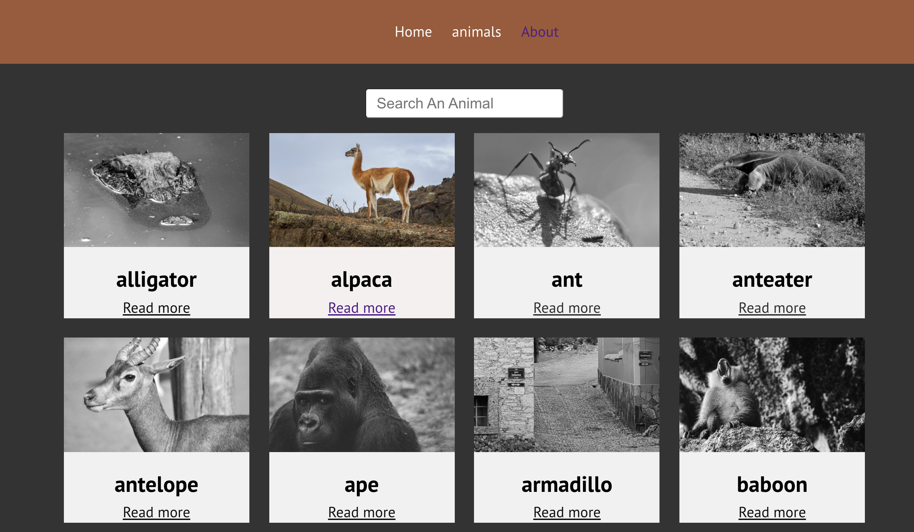

# Animals card

This is the project built with react app which includes class as well as functional components states and props to render the animals dynamically.Array of animals are mapped to get animal list.Here unsplash base url is taken and props(animal's name) is passed as endpoint to get the random picture of that animal.
Search input is handled using class component and setState() method.
Routing to different pages are done using react-router-dom.
This app has three pages all of them render dynamically in browser.

## Technologies used

Built with:

- HTML
- CSS
- JS
- Reactjs

## Screenshot

## Sources

- [reactjs documentation](https://reactjs.org/tutorial/tutorial.html)
- [react router](https://reactrouter.com/web/guides/quick-start)

## Authors and acknowledgment

Anjula Timsina

- [GitHub](https://github.com/meanjula)
- [linkedIn](https://www.linkedin.com/in/meanjula/)
